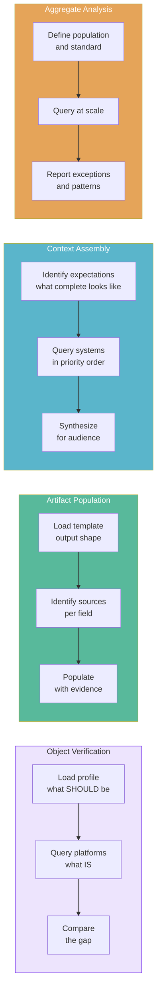

# Evidence Patterns

Every task uses one of four gathering strategies. The routing registry assigns a pattern to each archetype. The pattern determines HOW evidence is gathered, not WHAT evidence to gather (that comes from profiles and applicability rules).

## The Four Patterns

## Object Verification

**Used for:** troubleshoot, verify, commission, provision, decommission, evaluate

**The core idea:** Load what SHOULD be (the profile), query what IS (the platforms), and the gap between them is the answer.

| Step | What Happens | Source |
|------|-------------|--------|
| 1. Load profile | What does a healthy/correct version of this object look like? | `references/object-profiles/*.yaml` |
| 2. Check applicability | Which platforms are required for this object type? | `config/routing/applicability.yaml` |
| 3. Query platforms | What does each platform say about this specific object? | MCP tools, browser, manual |
| 4. Run consistency checks | Do values agree across platforms? | Profile `consistency` section |
| 5. Compare against healthy indicators | Does each platform show the expected state? | Profile `platforms` section |
| 6. If something is wrong, discriminate | What type of failure is this? Where to look next? | Profile `discrimination` section |

!!! example "Example"
    **Request:** "The network switch in Room 201 isn't responding"

    - Profile says: hostname, IP, serial must exist in inventory. Forward and reverse DNS. Monitoring reporting.
    - Inventory says: switch exists, status: active, IP: 10.0.1.50
    - DNS says: hostname resolves to 10.0.1.50 (match)
    - Monitoring says: device unreachable since 14:32
    - Discrimination: "device unreachable" -> likely causes: power failure, uplink down, IP conflict, hardware failure. First check: monitoring.
    - Result: monitoring confirms unreachable. Next step: check uplink switch port.

## Artifact Population

**Used for:** create ticket, draft email, generate checklist, produce report, build data entry sheet

**The core idea:** Load the output template, identify where each field's value comes from, gather the evidence, populate.

| Step | What Happens | Source |
|------|-------------|--------|
| 1. Load template | What does the output look like? | `templates/*.md` |
| 2. Identify sources per field | Where does each value come from? | Domain knowledge, profiles, live platforms |
| 3. Gather evidence | Query each source for the values needed | MCP tools, project files, references |
| 4. Populate the template | Fill in every field with attributed values | Verified data |
| 5. Verification summary | Show where each value came from | Delivered with the artifact |

## Context Assembly

**Used for:** meeting prep, status update, briefing, stakeholder summary

**The core idea:** Assemble current state from multiple sources for a human audience.

| Step | What Happens | Source |
|------|-------------|--------|
| 1. Identify evidence expectations | What does "complete" look like for this workflow? | `references/target-states/` evidence expectations |
| 2. Determine data priority | Which sources take precedence? | Data source priority in workflow rules |
| 3. Query in priority order | Gather from the most authoritative source first | MCP tools, project files, email, calendar |
| 4. Synthesize for the audience | Shape for the user's role | Role definition |

## Aggregate Analysis

**Used for:** fleet health, portfolio review, lifecycle analysis, audit, vendor performance

**The core idea:** Query across many objects, compare against a standard, report exceptions and patterns.

| Step | What Happens | Source |
|------|-------------|--------|
| 1. Define the population | What collection of objects? | Query parameters |
| 2. Define the standard | What should each object look like? | Object profiles |
| 3. Query at scale | Get data for all objects in the population | MCP tools (bulk queries) |
| 4. Compare each against the standard | Which objects deviate? | Profile comparison |
| 5. Report exceptions and patterns | What's wrong and where? | Aggregate the gaps |

!!! info "Choosing the right pattern"
    The routing registry assigns patterns to archetypes. You rarely need to choose manually. But if you're building a new archetype, ask: "Am I comparing one thing against its target state (verification), populating a structured output (artifact), assembling context for a human (assembly), or analyzing many things against a standard (analysis)?"
