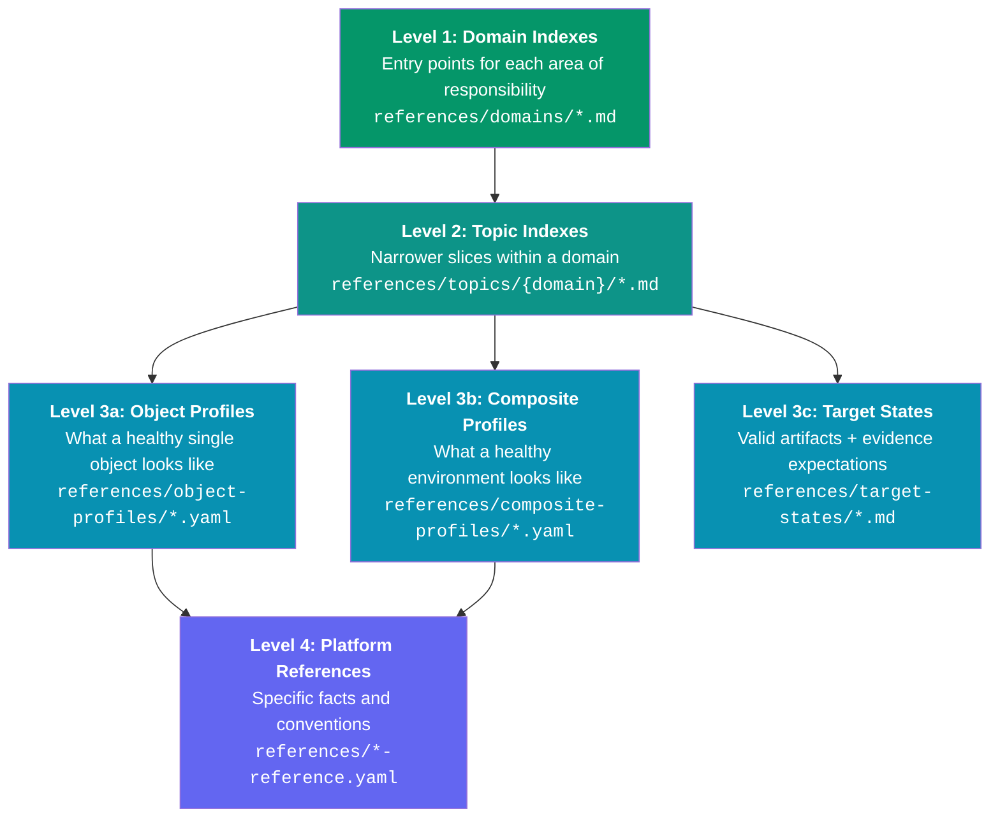

# Knowledge Hierarchy

The knowledge layer is organized in four levels, from broad to specific. The agent navigates down the tree to find the knowledge relevant to the current task.

## The Four Levels



## Level 1: Domain Indexes

**What:** Entry points for each area of your team's responsibility.

**Example domains:** Infrastructure, AV, Printing, Security, Project Management, Support

**Contents:**
- Scope (what falls in this domain)
- Topics (with links to profiles, references, tools, source registry entries)
- Cross-domain connections (when to jump to another domain)

!!! tip "Start here"
    When building your first setup, create domain indexes first. They're the scaffolding everything else hangs from. Use `./setup/create-domain.sh` to generate the correct structure.

## Level 2: Topic Indexes

**What:** Narrower slices within a domain. Focused on a specific family of tasks or objects.

**Example topics:** Video Conferencing (within AV), Network Devices (within Infrastructure), Portfolio Health (within Project Management)

**Contents:**
- Comparison questions (what the agent should answer)
- Evidence surfaces (what files and systems to consult)
- Expansion triggers (when to broaden into other domains, max 6)

## Level 3: Profiles

Three types of profiles serve different scopes:

=== "Object Profiles"

    **What a healthy single object looks like** across all relevant platforms.

    This is the most powerful concept in the framework. An object profile defines:

    - **Platforms:** what fields should exist and what "healthy" looks like per platform
    - **Consistency:** what should match across platforms (hostname, IP, serial)
    - **Discrimination:** when something is wrong, how to classify the failure type
    - **Not-applicable:** what platforms don't apply (prevents over-checking)

    ```yaml
    # Example: what matches across platforms
    consistency:
      - check: "hostname match"
        compare: [inventory.hostname, dns.hostname, monitoring.monitor_name]
      - check: "IP match"
        compare: [inventory.ip_address, dns.ip_address]
    ```

=== "Composite Profiles"

    **What a correctly built environment looks like** (room, space, facility).

    Unlike object profiles (single object), composite profiles define what equipment categories belong in a space and how to verify completeness. They point to individual object profiles for each component.

    ```yaml
    equipment_categories:
      - category: video_conferencing
        object_profile: references/object-profiles/codec-profile.yaml
        quantity: "1"
      - category: display
        quantity: "1-2"
      - category: scheduling_panel
        quantity: "1"
    ```

=== "Target States"

    **What a correct artifact or workflow looks like.**

    For things that aren't devices or rooms: what does a valid incident report contain? What evidence makes meeting prep "complete"?

    Categories: `valid-artifact`, `evidence-expectations`, `state`

## Level 4: Platform References

**What:** Specific facts, conventions, and parameters for each connected platform.

**Contents:** Naming conventions, field mappings, lifecycle states, authentication details, API quirks.

These are the detailed factual layer. Object profiles reference them for platform-specific knowledge.

## How the Agent Navigates

When a user asks a question:

1. **Routing** selects the primary domain (Level 1)
2. The domain index points to the relevant **topic** (Level 2)
3. The topic points to the relevant **profile** (Level 3)
4. The profile references **platform details** (Level 4) as needed
5. Each level adds knowledge; the agent stops when it has enough

The agent doesn't load the whole tree. It loads only what the current task requires. A simple status check might only reach Level 2. A deep troubleshooting investigation might traverse all four levels.
