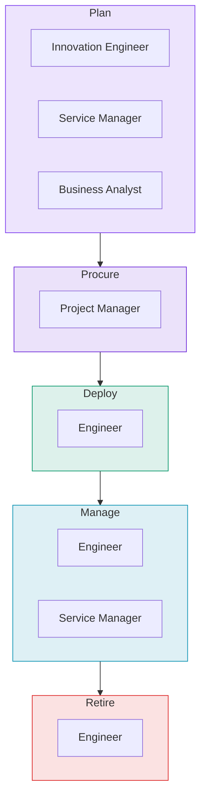

# Operations Framework

Before you define profiles or wire up platforms, you need an operational model: what does your team manage, how does work flow, and who does what?

This page defines a generic operations framework for teams that manage technology in physical workspaces. It's ITIL-aligned, tool-agnostic, and designed to be adopted progressively.

!!! tip "Start with Part 1"
    You don't need to absorb this entire page. Start with the three foundational concepts in Part 1. Everything else builds on them.

---

## Part 1: What You Manage

Three foundational concepts. These are the building blocks that everything else references.

### Technology Standards

A technology standard defines what equipment your team uses and why.

Without standards, every office ends up with different equipment, different configurations, and different support needs. Standardisation is what makes remote management at scale possible.

| Category | Example Standard |
|----------|-----------------|
| Video conferencing (large room) | Vendor X, Model A with external camera |
| Video conferencing (small room) | Vendor X, Model B with built-in camera |
| Digital signage | Vendor Y, Model C with cloud management |
| Network switch | Vendor Z, Model D (24-port PoE+) |

**Who owns this:** Innovation engineers and service managers evaluate new equipment, run pilots, and set the standard. Engineers and PMs build to it.

### Space Types

A space type defines what belongs in a particular kind of room or area. It combines technology standards with room-specific requirements: how many displays, what size, where they mount, what cabling and power are needed.

| Space Type | Key Equipment |
|------------|--------------|
| Small meeting room (4 people) | 1x video bar, 1x 55" display, 1x room scheduler |
| Large conference room (12 people) | 1x codec, 1x camera, 2x 75" displays, ceiling microphone |
| Flex workstation | 1x monitor with USB-C hub |
| Server/comms room | Rack(s), switches, patch panels, PDU, UPS, sensor |
| Lobby/reception | 1x signage display, 1x media player |

Each space type has a bill of materials (BOM) listing every item, quantity, and power/data requirements.

### Device Profiles

A device profile defines what "correct" looks like for a specific device type across every system it touches. It's a verification reference, not a setup guide.

!!! info "This maps directly to Object Profiles"
    In the framework, device profiles are implemented as [object profiles](../schemas/content.md). The schema defines the structure; the operations framework defines why they exist.

**Example: what "correct" looks like for a video codec**

| System | Expected State |
|--------|---------------|
| Inventory (DCIM) | Record exists, status "active", serial number recorded |
| DNS/DHCP | Forward and reverse DNS resolve to the correct IP |
| Monitoring | Device reporting, correct tags, no active alerts |
| Fleet management | Registered, firmware current, managed by correct tenant |
| Control plane | Registered with conferencing service, reachable |

---

## Part 2: How Work Happens

### Three Work Patterns

All work fits into one of three patterns:

=== "Projects"

    Planned work with a start and end date. A project delivers changes to spaces by installing, replacing, or removing devices.

    *Example: "Replace all video codecs at the London office."*

=== "Incidents"

    Unplanned, reactive work triggered by an alert or user report. Incidents follow their own flow: detect, triage, diagnose, resolve, close.

    *Example: "The printer at Munich is offline."*

=== "Service Management"

    Ongoing, continuous work without a start or end date. Fleet health monitoring, warranty tracking, vendor contract management, lifecycle planning.

    *Example: "Quarterly fleet health review across all offices."*

### The Device Lifecycle

Every device moves through five stages. This lifecycle is aligned with the ITIL IT Asset Lifecycle.

| Stage | What Happens | Who Leads |
|-------|-------------|-----------|
| **Plan** | Standards set, scope defined, budget approved | Innovation engineer, service manager, business analyst |
| **Procure** | Purchase order raised, hardware ordered, shipped, received | PM, procurement |
| **Deploy** | Device provisioned, configured, installed, commissioned | Engineer |
| **Manage** | Device monitored, maintained, patched, supported | Engineer, service manager |
| **Retire** | Device decommissioned, records cleaned up, hardware removed | Engineer |

### Tasks Within Each Stage

Each stage contains defined tasks. Tasks can be assigned to different people per project, and each task has an estimated duration for capacity planning.

#### Plan

| Task | Description |
|------|------------|
| Evaluate | Assess new equipment options, run pilots, compare against current standards |
| Standardise | Set or update the technology standard based on evaluation results |
| Scope | Define which spaces and devices are in scope for a project |
| BOM | Generate the bill of materials from space type standards |
| Budget | Estimate cost, secure funding approval |
| Approve | Get project approval and assign resources |

#### Procure

| Task | Description |
|------|------------|
| Order | Raise purchase order with the approved vendor |
| Ship | Track shipment to the destination site |
| Receive | Confirm hardware arrival, verify against PO, note storage location |
| Asset-tag | Record the asset in the inventory system with serial number and PO reference |

#### Deploy

| Task | Description |
|------|------------|
| Provision | Create the device's identity in systems of record: inventory, IP, DNS |
| Configure | Apply device settings: firmware, network config, platform registration |
| Install | Physically rack or mount the device, connect power and network cables |
| Commission | Verify end-to-end: DNS resolves, monitoring reports, functional test passes |

!!! warning "The Commissioning Checkpoint"
    Between Deploy and Manage there is a commissioning checkpoint. The device moves to the "active" production state only after all commissioning checks pass. This is the quality gate that prevents unverified devices from entering production.

#### Manage

| Task | Description |
|------|------------|
| Monitor | Watch for alerts, respond to health changes |
| Maintain | Apply firmware updates, renew certificates, adjust configurations |
| Troubleshoot | Diagnose and resolve problems reported by users or monitoring |
| Support | Coordinate with vendors for break-fix, dispatch field engineers |
| Track warranty | Monitor warranty and support contract expiration dates |

#### Retire

| Task | Description |
|------|------------|
| Decommission | Mark the device for removal, silence monitoring |
| Release records | Remove IP reservation, delete DNS entries, remove cable records |
| Remove monitoring | Delete or disable monitoring for the device |
| Physically remove | Un-rack or unmount the device, disconnect cables |
| Dispose | Return, recycle, or dispose of the hardware per policy |

!!! info "Tasks are extensible"
    The tasks listed here are starting points. Add, remove, or rename tasks to match how your team actually works. Common extensions include compliance/audit tasks, vendor-specific coordination steps, and refurbishment tasks. Adding a task doesn't change the lifecycle stages or the concepts.

### Project Stages

Projects move through a delivery workflow tracked by the project management team. The exact stage names vary by organisation, but the typical flow is:

| Stage | Description |
|-------|------------|
| Scope | Define what the project will deliver |
| Design | Finalise technical design and space layouts |
| Procure | Order equipment and materials |
| Prepare | Ship hardware, coordinate with vendors, schedule access |
| Execute | Install and configure equipment on site |
| Validate | Run commissioning checks, resolve issues |
| Close-out | Update records, upload documentation, mark complete |

Project stages and device lifecycle stages are related but tracked separately. A project may contain devices at different lifecycle stages simultaneously.

---

## Part 3: Roles

Different roles interact with different concepts. Nobody needs to understand everything.

| Role | Primary Concepts | Focus |
|------|-----------------|-------|
| **Innovation engineer** | Technology standards, space types | Evaluating equipment, setting standards, designing solutions |
| **Business analyst** | Space types, technology standards | Translating standards into site-specific scope documents |
| **Program manager** | Projects | Portfolio health, resource allocation across projects |
| **Project manager** | Projects, project stages | Delivery timelines, vendor coordination, stage progression |
| **Engineer** | Device profiles, lifecycle stages | Provisioning, commissioning, maintaining, troubleshooting |
| **Service manager** | Device profiles, technology standards | Fleet health, lifecycle planning, vendor performance |
| **Manager** | Projects, project stages | Portfolio status, delivery metrics, team capacity |

---

## Part 4: Capacity Planning

Each task has an estimated duration. For any project, multiply the task estimate by the number of devices in scope to get the total effort.

### Example Estimates

These are starting points. Your team adjusts them based on experience.

| Task | Estimate Per Device | Varies By |
|------|-------------------|-----------|
| Provision | 0.5 hours | Number of systems to update |
| Configure | 1-3 hours | Device complexity, remote vs on-site |
| Install | 1-2 hours | Physical access, cabling requirements |
| Commission | 0.5-1 hour | Number of verification checks |
| Decommission | 0.5 hours | Number of systems to clean up |

### Project Estimation Example

For a project replacing 10 video codecs:

| Task | Per Device | x Devices | Total |
|------|-----------|-----------|-------|
| Provision | 0.5h | 10 | 5h |
| Configure | 2h | 10 | 20h |
| Install (vendor) | 1.5h | 10 | 15h (vendor) |
| Commission | 1h | 10 | 10h |
| Decommission (old) | 0.5h | 10 | 5h |
| **Total engineering** | | | **40h** |

### Improving Estimates Over Time

Most infrastructure management systems timestamp record changes. When a device record is created (provision started) and when monitoring first reports (commission complete), the elapsed time is captured automatically. Over time, actual durations replace initial estimates.

The tasks that consume the most hours across the team are the best automation candidates. Capacity data tells you where automation delivers the most value.

---

## Part 5: Logical and Physical Device Identity

When a device is replaced, the new hardware takes on the same role in the same location. This creates a distinction:

| Identity | What It Tracks | Changes at Replacement? |
|----------|---------------|------------------------|
| **Logical** (hostname, DNS, monitoring) | The role and location | No, stays the same |
| **Physical** (serial number, asset tag) | The actual hardware | Yes, each box is different |

During a replacement, the old and new devices are tracked as two separate records. The old device is renamed (e.g., with a `-legacy` suffix) while the new device takes the production name. This ensures:

- No ambiguity during the overlap period
- Clean historical tracking
- DNS, monitoring, and documentation stay stable across replacements

---

## Part 6: Mapping to the Framework

The six operational concepts map directly to the framework's primitives:

| Operational Concept | Framework Primitive | Key Files |
|--------------------|-------------------|-----------|
| Technology standards | Platform references | `references/*-reference.yaml` |
| Space types | Composite profiles | `references/composite-profiles/*.yaml` |
| Device profiles | Object profiles | `references/object-profiles/*.yaml` |
| Projects | Object type in routing | `config/routing/registry.yaml` |
| Project stages | Target states | `references/target-states/*.md` |
| Lifecycle stages | Applicability conditions | `config/routing/applicability.yaml` |
| Tasks | Evidence patterns + templates | `templates/*.md`, `playbooks/*.yaml` |

The [knowledge hierarchy](knowledge-hierarchy.md) organises all of this into navigable layers. The [routing registry](../schemas/config.md) determines which knowledge to load for each request. The [governance model](governance.md) controls what actions are allowed at each lifecycle stage.

[:octicons-arrow-right-24: Knowledge Hierarchy](knowledge-hierarchy.md) · [:octicons-arrow-right-24: Evidence Patterns](evidence-patterns.md) · [:octicons-arrow-right-24: Governance Model](governance.md)

---

## Adapting This Framework

### For Your Team

1. List your technology standards (what equipment do you use?)
2. List your space types (what types of rooms or areas do you manage?)
3. Define your device profiles (what does "correct" look like per device type?)
4. Map your existing processes to the five lifecycle stages
5. Identify the tasks within each stage
6. Assign estimated hours to each task
7. Map your team's roles to the concepts they interact with

### What to Customise

| Component | Universal (keep) | Your Version |
|-----------|-----------------|-------------|
| Five lifecycle stages | Plan, Procure, Deploy, Manage, Retire | Same |
| Six concepts | The structure | Your standards, spaces, profiles |
| Tasks per stage | The categories | Your specific tasks and estimates |
| Roles | The role types | Your titles and people |
| Tools | Replace entirely | Your platforms |

### What to Extend

The tasks listed under each stage are starting points. Add, remove, or rename tasks to match how your team actually works. Common extensions:

- Teams with compliance requirements add audit and certification tasks to each stage
- Teams managing cloud infrastructure add provisioning tasks for their platforms
- Teams with significant vendor coordination add vendor-specific tasks to Deploy and Manage
- Teams with hardware repair capabilities add refurbishment tasks to Retire

### What Not to Change

The five lifecycle stages and three work patterns are industry-standard (ITIL). Changing them means departing from a model your vendors, auditors, and partner teams already understand.
