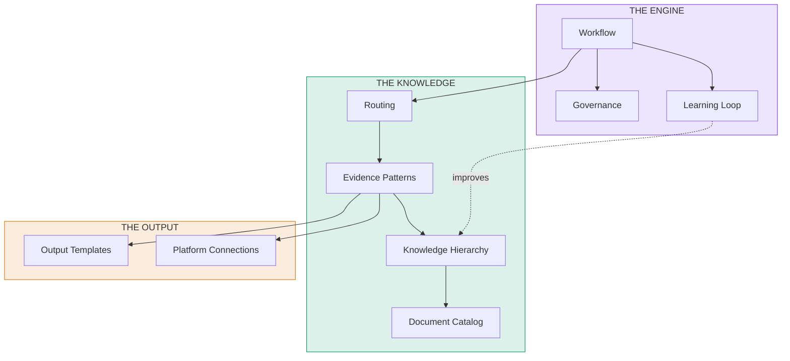
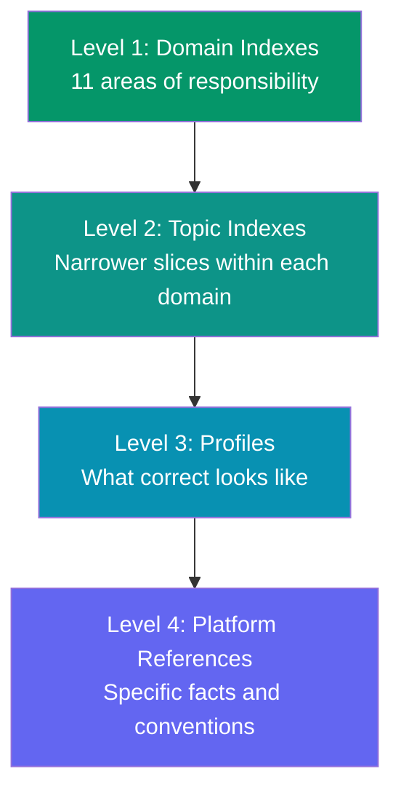
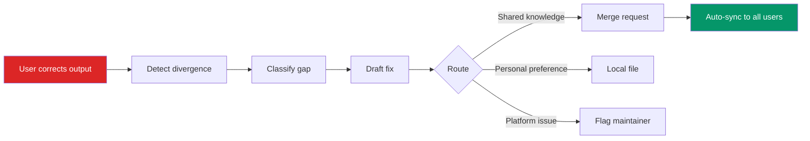

# The 9 Primitives

Everything in the framework is built from nine fundamental concepts. Every file, every rule, every tool call traces back to one of these.

## Overview

## 1. Workflow (URAD-L)

The 5-phase processing loop that handles every request.

**Key file:** `.cursor/rules/workflow.mdc`

Every request flows through: Understand, Resolve, Act, Deliver, Learn. No exceptions. Simple questions might pass through in seconds. Complex investigations may loop through Resolve multiple times as the evidence frontier expands.

[:octicons-arrow-right-24: Deep dive into the workflow](workflow.md)

## 2. Routing

The thin declarative selector that maps requests to starting points.

**Key file:** `config/routing/registry.yaml`

A request is classified as an archetype (troubleshoot, verify, draft, synthesize...) combined with an object type (device, project, environment...) and a scope (single, site, fleet...). The routing registry maps this combination to an evidence pattern and a first frontier.

!!! info "Why routing is thin"
    The routing layer seeds reasoning; it doesn't script procedures. It says "start here" not "do steps 1-2-3." This keeps the system flexible while ensuring it always starts in the right place.

## 3. Evidence Patterns

Four universal strategies for gathering information. Every task uses one.

| Pattern | Used For | Core Process |
|---------|---------|-------------|
| **Object Verification** | Troubleshoot, verify, commission | Load profile (SHOULD), query platforms (IS), compare the gap |
| **Artifact Population** | Create tickets, drafts, reports | Load template, identify sources per field, populate |
| **Context Assembly** | Meeting prep, status updates | Identify expectations, query in priority order, synthesize |
| **Aggregate Analysis** | Fleet health, audits, reviews | Define population + standard, query at scale, report exceptions |

[:octicons-arrow-right-24: Deep dive into evidence patterns](evidence-patterns.md)

## 4. Knowledge Hierarchy

Four levels from broad to specific. The agent navigates down the tree to find the knowledge relevant to the current task.

[:octicons-arrow-right-24: Deep dive into the knowledge hierarchy](knowledge-hierarchy.md)

## 5. Document Catalog

The Source Registry points to live team documents without embedding them. Documents stay where they are (wiki, Drive, Confluence). The framework knows they exist, what domain they belong to, and how to access them.

**Key files:** `registry/sources/*.yaml`

Each entry has tiered access: API (fastest), Browser (fallback), Manual (last resort).

## 6. Platform Connections

MCP tools and browser automation that connect the agent to live systems.

**Key file:** `config/tool-classification.yaml`

Every tool is classified into a governance tier before it can be used.

## 7. Governance

Three tiers control what the agent is allowed to do:

| Tier | Rule | Confirmation |
|------|------|-------------|
| :material-eye:{ .middle } **Read** | Execute autonomously | None needed |
| :material-pencil:{ .middle } **Write** | Preview, confirm, execute, **verify** | Required |
| :material-cancel:{ .middle } **Prohibited** | Never execute | N/A |

Plus five safety boundaries: loop detection, scope boundary, resource budget, wall-clock check-in, and rollback guidance.

[:octicons-arrow-right-24: Deep dive into governance](governance.md)

## 8. Output Templates

Deterministic shapes for structured outputs. When the agent produces a ticket, checklist, or report, it follows the corresponding template.

**Key files:** `templates/*.md`

Templates define output shape only. They don't determine the reasoning path.

## 9. Learning Loop

Corrections feed back into the knowledge layer. When a user corrects the agent or takes a different path than planned, the system captures what went wrong, classifies the gap, drafts a fix, and routes it for review.

## Composites

Everything else is built by combining primitives:

| Composite | Built From |
|-----------|-----------|
| **Playbooks** | Routing + Evidence Patterns + Templates, in sequence |
| **Skills** | Shortcuts for specific primitive combinations |
| **Roles** | Governance + Output filters per audience |
| **Standards** | Reference data that Profiles and Templates enforce |
