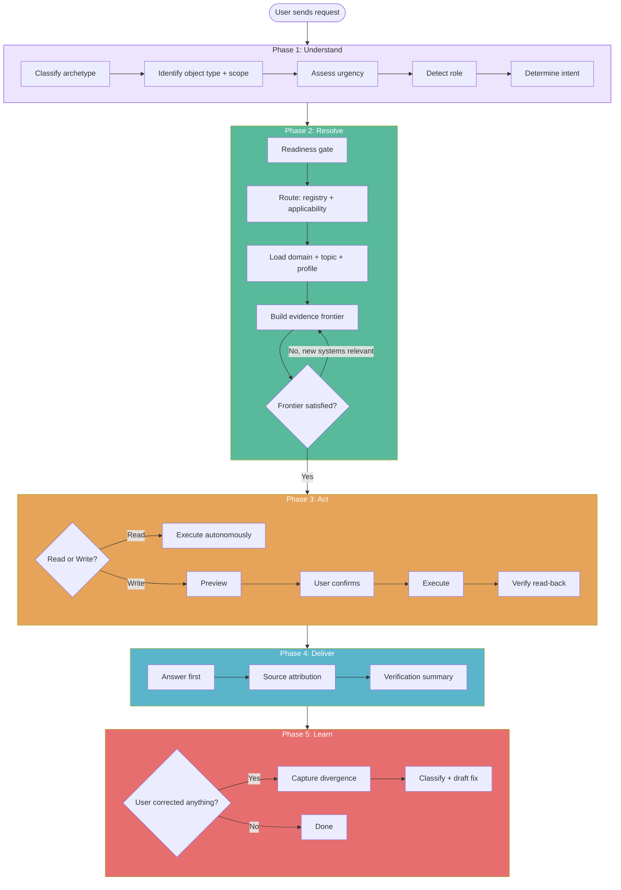

# The Workflow (URAD-L)

Every request flows through five phases. No exceptions.

## The Flow



## Phase 1: Understand

**Purpose:** What does the user need?

The agent classifies the request before doing any work:

| Signal | What It Determines | Source |
|--------|-------------------|--------|
| Archetype | What kind of work (troubleshoot, verify, draft, synthesize...) | `config/routing/registry.yaml` |
| Object type | What it's about (device, project, environment...) | `config/routing/registry.yaml` |
| Scope | How big (single, group, site, fleet, portfolio) | From the request |
| Urgency | How fast (imminent deadline = high) | From the request |
| Role | Who is asking (engineer, PM, manager) | `config/roles/` |
| Intent | What they want (information, exploration, action) | From the request phrasing |

!!! tip "Intent determines governance"
    A question ("Is there a way to...") never triggers write governance. Only directive intent ("Update the record") proceeds to the Preview step.

## Phase 2: Resolve

**Purpose:** Assemble the right knowledge for this specific task.

This is where the framework's power lives. Instead of guessing, the agent follows a structured resolution path:

1. **Readiness gate** - check auth and availability before deep work
2. **Route** - look up the archetype + object + scope combination
3. **Applicability** - determine required, optional, and not-applicable systems
4. **Domain** - load the domain index, follow links to topics and profiles
5. **Profile** - load what "correct" looks like for the object in scope
6. **Evidence frontier** - gather evidence, expand if needed, stop when satisfied

The resolution is iterative. If checking system A reveals that system B is also relevant, the frontier expands and Resolve continues.

## Phase 3: Act

**Purpose:** Execute the task with governance.

=== "Reads"

    Executed autonomously. No confirmation needed. The agent queries platforms, gathers data, and compares against profiles.

=== "Writes"

    Follow the full lifecycle:

    ```
    Preview --> User Confirms --> Execute --> Verify (read-back) --> Report
    ```

    - **Preview**: What, Where, Values (with sources), How, Reversible?
    - **Verify**: Read back from the system to confirm the change landed
    - If verification fails: stop, report, assess partial state

Safety boundaries are active throughout: loop detection, scope boundary, resource budget, wall-clock check-in.

## Phase 4: Deliver

**Purpose:** Present results for the user's role.

Rules:

- **Answer-first**: The conclusion before the evidence, not after
- **Self-contained**: The user may not see tool call output; the final answer has everything
- **Attributed**: Every value tagged with its source and trust level
- **Linked**: Every resource with a known ID is a clickable link
- **Role-appropriate**: Technical detail for engineers, timelines for PMs, decisions for managers

## Phase 5: Learn

**Purpose:** Turn corrections into shared improvements.

The agent compares what it planned (the resolution plan from Phase 2) against what actually happened. If the user corrected, redirected, or expanded the task, that's a signal.

| Signal Type | Example | Classification |
|------------|---------|----------------|
| System addition | "Also check the monitoring" | Applicability gap |
| Value override | "The IP is actually .15" | Knowledge gap |
| Sequence redirect | "Check the PDU first" | Routing gap |
| Scope change | "Check the other rooms too" | One-off (probably) |

Fixes are drafted, submitted for review, and delivered to all users via auto-sync.
