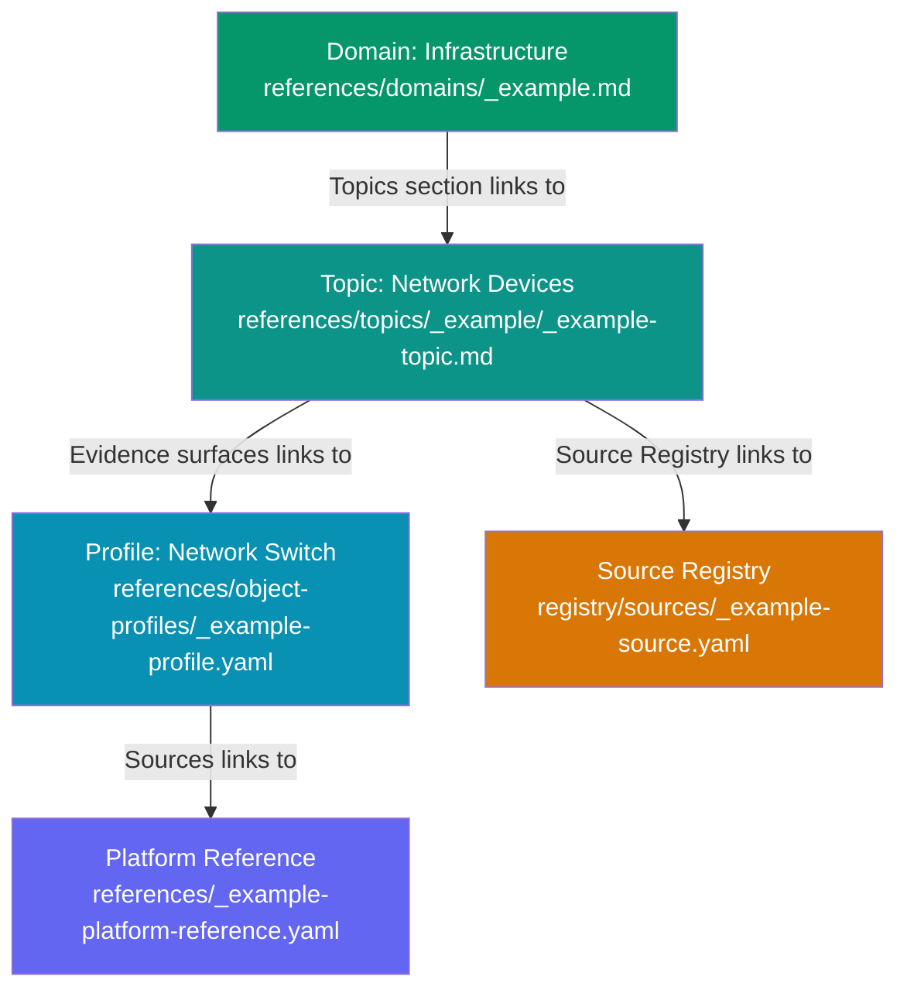

# Example: Infrastructure Domain

This example shows an infrastructure domain with a network devices topic and a network switch object profile. It demonstrates how the knowledge hierarchy connects.

## Domain Index

The infrastructure domain covers network devices, power distribution, structured cabling, and server rooms.

**File:** `references/domains/_example.md`

Key sections:
- **Scope:** what falls in this domain
- **Topics:** network devices, power distribution (with profile, reference, tool, and registry links)
- **Cross-domain connections:** device failure may trace to AV or Print; power alerts expand into UPS/PDU

## Topic Index

The network devices topic covers switches, access points, routers, and OOB management.

**File:** `references/topics/_example/_example-topic.md`

Key sections:
- **Comparison questions:** Does identity match across inventory and DNS? Is firmware current?
- **Expansion triggers:** identity mismatch -> asset management; connected device failures -> AV/Print; power issue -> power distribution

## Object Profile

The network switch profile defines what a healthy switch looks like across inventory, DNS, monitoring, and port management.

**File:** `references/object-profiles/_example-profile.yaml`

Key sections:
- **4 platforms** with required fields and healthy indicators
- **3 consistency checks** (hostname, IP, serial must match across platforms)
- **3 discrimination entries** (unreachable, port not working, high CPU)
- **Not-applicable:** fleet management, content management

## How They Connect

