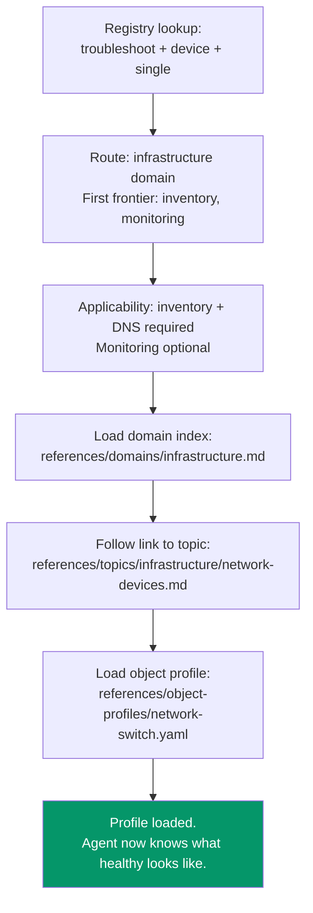
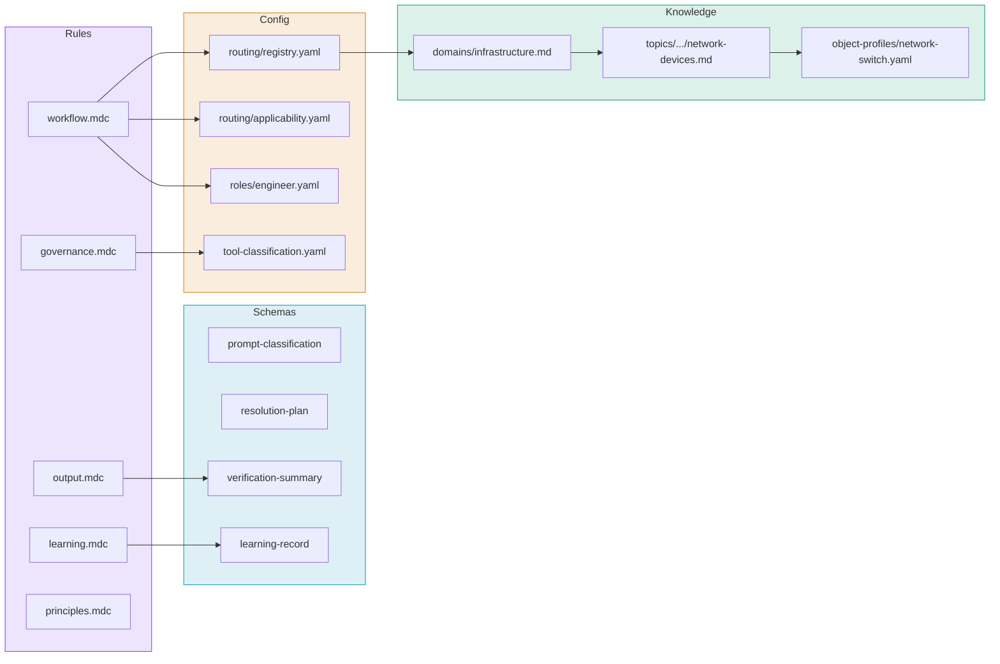

# How It All Connects: Full Walkthrough

Trace a single request through the entire framework, file by file, showing every primitive in action.

## The Request

> "The network switch in Maple Room isn't responding."

## Phase 1: Understand

The agent reads `workflow.mdc` and classifies:

```yaml
archetype: troubleshoot
object_type: device
scope: single
device_class: network_switch
urgency: high
role: engineer
intent: directive
evidence_pattern: object_verification
```

**Files used:** `workflow.mdc`, `config/routing/registry.yaml`, `config/roles/engineer.yaml`

## Phase 2: Resolve



**What the agent now knows:**

| From Profile | Knowledge Gained |
|-------------|-----------------|
| `platforms.inventory` | Required fields: hostname, IP, serial, rack, status |
| `platforms.dns` | Forward and reverse records must exist |
| `platforms.monitoring` | Device should be reporting metrics |
| `consistency` | Hostname must match across inventory, DNS, monitoring |
| `discrimination.device_unreachable` | Likely causes: power, uplink, IP conflict, hardware. Check monitoring first. |
| `not_applicable` | Don't check fleet management or content management |

## Phase 3: Act

The agent queries platforms and compares:

| System | Query | Finding | Profile Comparison |
|--------|-------|---------|-------------------|
| Inventory | Get device by hostname | Found. Status: active. IP: 10.0.1.50 | :material-check: Required fields present |
| DNS | Resolve hostname | Resolves to 10.0.1.50 | :material-check: IP matches inventory |
| Monitoring | Get device status | **Unreachable since 14:32** | :material-alert: Not healthy |

**Discrimination logic activates:**

The profile says for "device_unreachable": check monitoring first (done), likely causes are power, uplink, IP conflict, hardware.

Monitoring shows the device went unreachable at 14:32. The agent checks: is anything else at this site unreachable? (expansion trigger from the topic index)

**Scope boundary check:** Still investigating one device. No expansion needed yet.

## Phase 4: Deliver

The agent presents the answer:

!!! quote "Agent output"
    **Switch oak-f4-sw-01 is unreachable since 14:32 today.**

    - Inventory record is correct (status: active, all fields populated)
    - DNS resolves correctly (10.0.1.50 matches inventory)
    - Monitoring shows device unreachable since 14:32, no prior warnings

    **Likely causes** (from device profile): power failure, uplink port down, IP conflict, or hardware failure.

    **Recommended next step:** Check the uplink switch port. If the port is up, check physical power at the device.

    **Systems checked:** Inventory (live), DNS (live), Monitoring (live)
    **Systems not applicable:** Fleet management, content management (network switch)

## Phase 5: Learn

The user says: "You should also check the PDU to see if the outlet is powered."

The agent captures:

```yaml
signal: system_addition
planned: "Check inventory + DNS + monitoring"
actual: "User added PDU/power check"
classification: applicability_gap
proposed_fix:
  file: config/routing/applicability.yaml
  change: "Add power_management as optional for troubleshoot + network_switch when device_unreachable"
```

If the user approves, this fix is submitted as a merge request. After review and merge, every future "switch unreachable" investigation will also check the PDU.

## The Files That Participated



Every file had a role. The rules defined behavior. The config controlled routing and governance. The knowledge defined what "correct" looks like. The schemas defined the contracts between phases.
