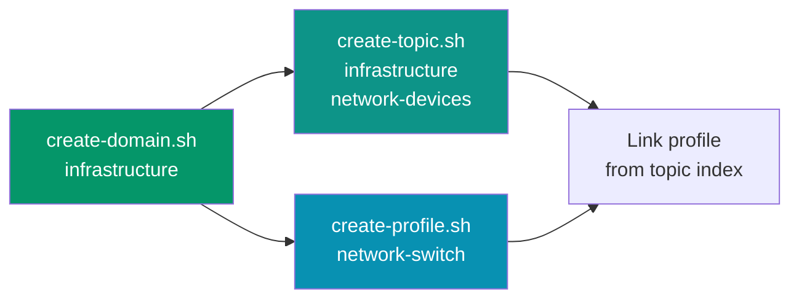

# Scaffolding CLI

Three shell scripts that create correctly structured files from the schemas. No guessing, no manual copying.

## create-domain.sh

Creates a domain index and topics directory.

```bash
./setup/create-domain.sh infrastructure
```

**Creates:**
- `references/domains/infrastructure.md` (with all required sections)
- `references/topics/infrastructure/` (empty, ready for topic indexes)

**Validates:** domain doesn't already exist.

## create-topic.sh

Creates a topic index within a domain.

```bash
./setup/create-topic.sh infrastructure network-devices
```

**Creates:**
- `references/topics/infrastructure/network-devices.md` (with comparison questions, expansion triggers)

**Validates:** domain exists, topic doesn't already exist.

## create-profile.sh

Creates an object profile.

```bash
./setup/create-profile.sh network-switch
```

**Creates:**
- `references/object-profiles/network-switch-profile.yaml` (with all required sections)

**Validates:** profile doesn't already exist. Sets `last_updated` to today's date.

## Workflow



After running the scripts, edit the generated files and fill in the placeholders. Then link the profile from the topic index, and the topic from the domain index.
