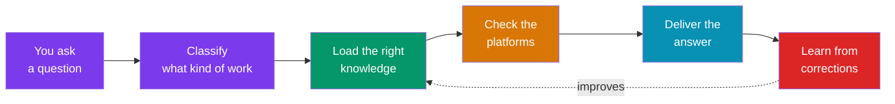

# Your AI doesn't know your domain. This fixes that.

AI assistants are smart. But they don't know what a healthy device looks like in your infrastructure. They don't know which of your thirty platforms to check. They don't know your team's standards, your naming conventions, or your documentation.

**This framework teaches them.**

---

## The Problem

You ask your AI: *"Is the codec in Maple Room healthy?"*

Without domain knowledge, the AI guesses. It might check one system and miss five others. It doesn't know that "healthy" means the device exists in your inventory, has DNS records, is reporting to monitoring, is registered in the fleet tool, and has the right firmware.

**With this framework**, the AI loads a profile that defines what "healthy" means across all your platforms, checks each one, and compares the gap.

---

## What It Does

-   :material-target:{ .lg .middle } **Knows what correct looks like**

    ---

    Profiles define "healthy" for every object type: devices, rooms, projects. The AI checks reality against the profile and spots what's wrong.

-   :material-routes:{ .lg .middle } **Checks the right systems**

    ---

    A routing layer classifies every request and selects which platforms to check. No over-checking. No under-checking.

-   :material-shield-check:{ .lg .middle } **Writes safely**

    ---

    Reads are automatic. Writes need your approval AND get verified: the AI reads back every change to confirm it landed.

-   :material-lightbulb-on:{ .lg .middle } **Gets smarter through use**

    ---

    When you correct the AI, it captures what went wrong, drafts a fix, and routes it for review. The whole team benefits.

---

## What People Use It For

=== "Engineer"

    **"Check if the codec in Maple Room is healthy across all systems."**

    The AI loads the codec profile, queries the inventory, DNS, fleet management, and monitoring systems. Cross-checks hostname, IP, firmware. Reports mismatches. Suggests fixes.

=== "Project Manager"

    **"What's the status of my Westfield project?"**

    The AI loads the project profile, checks the tracker for stage and dates, scans email for recent vendor communications, checks calendar for upcoming milestones. Flags stale notes and past-due dates.

=== "Manager"

    **"Prep me for the leadership call in 30 minutes."**

    The AI assembles project status, team capacity, open risks, and pending decisions from multiple sources. Delivers a brief shaped for your audience.

=== "Service Manager"

    **"How's the printer fleet health across EMEA?"**

    The AI queries the fleet across all sites, compares each device against the printer profile, reports exceptions by site. Firmware outliers, offline devices, missing records.

---

## How It Works (30-second version)

1. **You ask a question** (natural language, any editor)
2. **Classify**: what kind of work? About what? How big?
3. **Load knowledge**: the right domain, topic, and profile for this specific request
4. **Check platforms**: query the systems that matter, skip the ones that don't
5. **Deliver**: answer-first, with sources, shaped for your role
6. **Learn**: your corrections make the system better for everyone

---

## Where It Runs

This framework is files. The files work anywhere an AI agent can read them.

| Runtime | How |
|---------|-----|
| **Cursor** | Rules as `.cursor/rules/`, knowledge as workspace files |
| **Claude Code** | Rules as `CLAUDE.md`, same knowledge files |
| **Container platform (OpenShift, Kubernetes)** | Rules as agent system prompt, knowledge as structured YAML, tools via registered API connectors |
| **Any MCP-compatible editor** | Rules as `AGENTS.md`, same knowledge files |

No infrastructure to deploy. No SaaS subscription. Fork the repo, populate your domain, start asking questions.

---

## Get Started

-   :material-clock-fast:{ .lg .middle } **30-Minute Quickstart**

    ---

    Fork, create one domain, one profile, ask your first question.

    [:octicons-arrow-right-24: Get started](guides/quickstart.md)

-   :material-swap-horizontal:{ .lg .middle } **Migration Guide**

    ---

    You already have docs and tools. Here's where they map.

    [:octicons-arrow-right-24: Migrate](guides/migration.md)

---

## Under the Hood

For the technically curious: the framework is built from 9 primitives, 21 schemas, and 5 behavioral rules. It uses four evidence-gathering patterns, a thin routing layer, and a self-improving learning loop.

[:octicons-arrow-right-24: The 9 Primitives](concepts/primitives.md) · [:octicons-arrow-right-24: The Workflow](concepts/workflow.md) · [:octicons-arrow-right-24: Schema Reference](schemas/index.md) · [:octicons-arrow-right-24: Full Walkthrough](examples/walkthrough.md)
