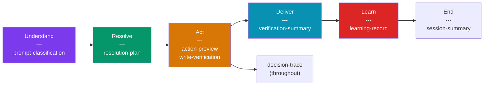

# Runtime Schemas

8 schemas that define what each workflow phase produces. These are not files on disk; they are contracts for the data structures the AI generates at runtime.

## Why Runtime Schemas Matter

Without runtime schemas, each workflow phase produces output in whatever format the AI chooses. With schemas, the output of Phase 2 (Resolve) is a structured resolution plan that Phase 3 (Act) and Phase 5 (Learn) can consume predictably.

This makes the phases **composable**: the output of one is the input of the next.

## prompt-classification

**Produced by:** Understand | **Consumed by:** Resolve

| Field | Type | Purpose |
|-------|------|---------|
| `archetype` | string | Matched archetype from routing registry |
| `object_type` | string | What the request is about |
| `scope` | enum | single, group, site, fleet, portfolio |
| `urgency` | enum | high, normal, low |
| `role` | string | Detected user role |
| `intent` | enum | informational, exploratory, directive |
| `evidence_pattern` | enum | Which of the 4 patterns applies |

## resolution-plan

**Produced by:** Resolve | **Consumed by:** Act + Learn

| Field | Type | Purpose |
|-------|------|---------|
| `primary_domain` | string | Which domain index was loaded |
| `required_systems` | list | Systems that must be checked |
| `optional_systems` | list | Systems that may be checked |
| `not_applicable` | list | Systems ruled out (with reason) |
| `profiles_loaded` | list | Profile paths loaded |
| `capability_level` | enum | domain_match, best_effort, limitation |

## action-preview

**Produced by:** Act (before each write) | **Consumed by:** User

| Field | Type | Purpose |
|-------|------|---------|
| `what` | string | One sentence: the action |
| `where` | string | Target system + record |
| `values` | table | Fields, values, sources |
| `how` | enum | api, browser, manual |
| `reversible` | string | Whether and how |

## write-verification

**Produced by:** Act (after each write) | **Consumed by:** Deliver

| Field | Type | Purpose |
|-------|------|---------|
| `verification_method` | enum | read_back, effect_check, not_verifiable |
| `outcome` | enum | verified, partial, failed, not_verified |
| `fields_checked` | table | Field, expected, actual, match |
| `partial_state_assessment` | string | Only for partial/failed multi-step writes |

## verification-summary

**Produced by:** Act/Deliver | **Consumed by:** User

| Field | Type | Purpose |
|-------|------|---------|
| `fields_verified` | table | Field, status, source, freshness |
| `discrepancies` | string | Data conflicts or "None" |
| `stale_data_warnings` | string | Sources past threshold or "None" |
| `systems_checked` | list | All systems queried |
| `systems_not_checked` | list | Missed systems (with reason) |

## learning-record

**Produced by:** Learn | **Consumed by:** Knowledge layer

| Field | Type | Purpose |
|-------|------|---------|
| `signal` | enum | system_addition, value_override, sequence_redirect, etc. |
| `planned` | string | What the agent planned (from resolution-plan) |
| `actual` | string | What the user did instead |
| `classification` | enum | knowledge_gap, routing_gap, applicability_gap, etc. |
| `proposed_fix` | object | File path + specific change |
| `submitted` | boolean | Whether the user approved |

## decision-trace

**Produced by:** All phases | **Consumed by:** Logging and analysis

Records the full decision chain: routing decision, systems checked/blocked, frontier expansions, tool calls (with status and latency), writes (with verification outcome), and divergences.

## session-summary

**Produced by:** End of session | **Consumed by:** Reporting

Aggregates: task count by archetype/domain/pattern, systems used, writes (total/verified/failed), corrections (detected/submitted), safety triggers.
